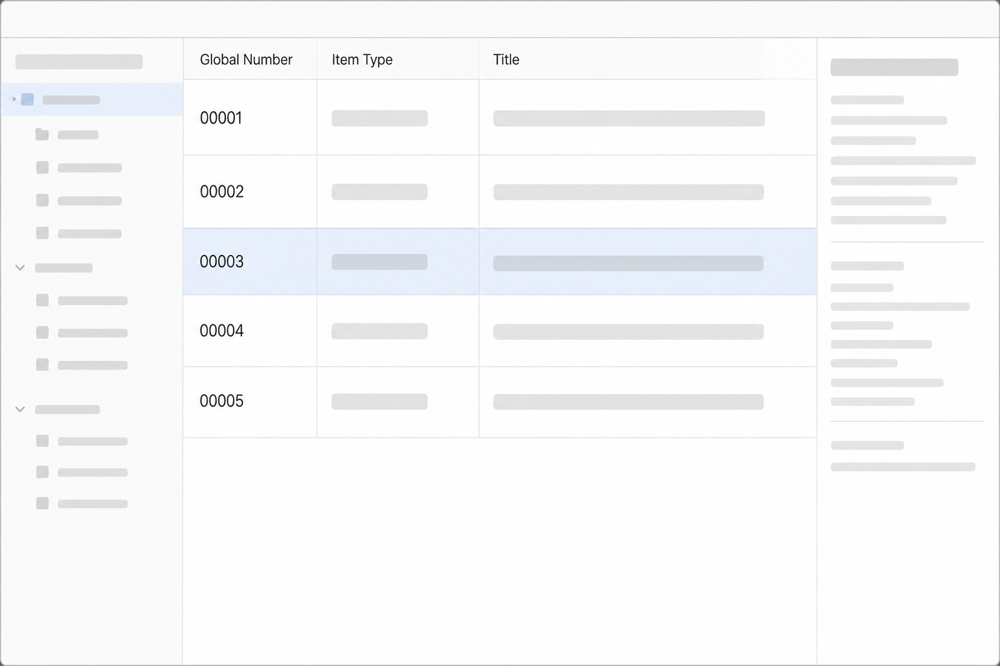

# Global Number for Zotero

[简体中文](README.md)


A small Zotero 9 plugin that assigns a unique, increasing global number to
regular items in My Library. It defaults to five digits (`00001`) and supports
1–12 configurable digits.



## Features

- Numbers new items from the Zotero Connector or manual entry.
- Shows the number in a resizable, sortable `Global Number` column.
- Shows the current maximum and next number, and configures number width, under
  `Tools → Global Number`.
- Can explicitly backfill existing unnumbered regular items without changing
  titles, tags, collections, or attachments.
- Continues from the largest synced number on another computer.

### Number width

Use `Tools → Global Number → Configure number width…` to choose 1–12 digits.
The value cannot be reduced below the digits required by the **next** number.
For example, once the maximum is `999`, the next number is `1000`, so the width
must be at least four digits. Existing stored numbers are never rewritten;
only newly assigned numbers use the new display width.

Numbers are stored in the syncable **Extra** field as a namespaced block, so
they do not occupy Zotero's built-in bibliographic fields:

```text
[global-number]
{"version":1,"number":"00001"}
[/global-number]
```

## Install and update

Install the XPI from the latest [GitHub Release](https://github.com/CatCodeMe/zotero-global-number/releases).
After the first installation, Zotero can update the plugin from its Plugins
Manager automatically or through **Check for Updates**.

## Development

Change the code and bump `version` in `addon/manifest.json`. A merge to `main`
then creates a versioned XPI, SHA-256 update manifest, and GitHub Release.

AI tagging is intentionally out of scope for v0.1: this plugin does not send
item data or API keys anywhere.
